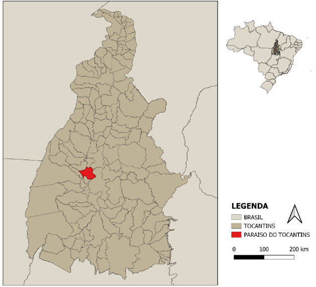
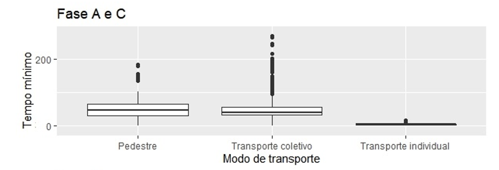
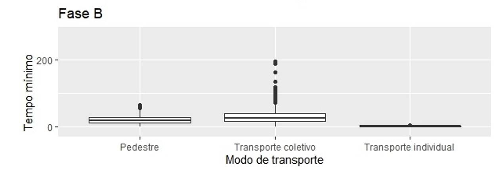
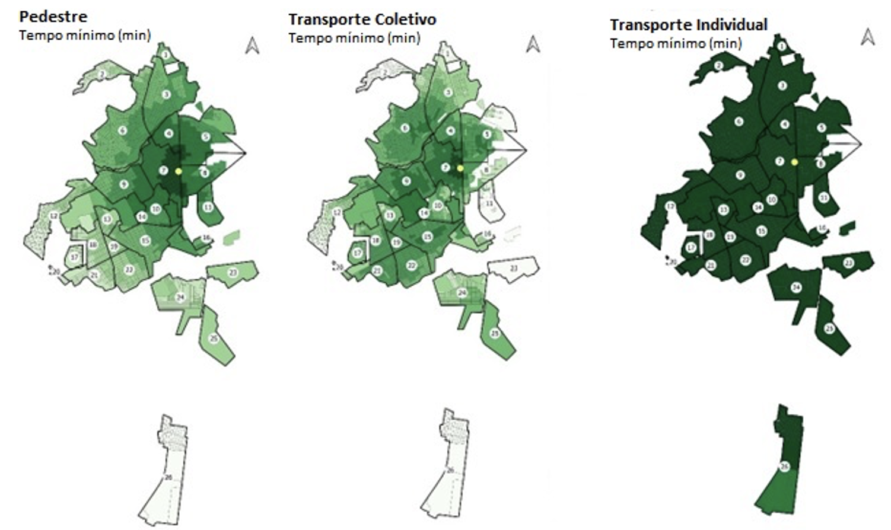
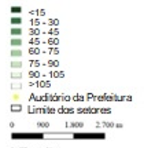
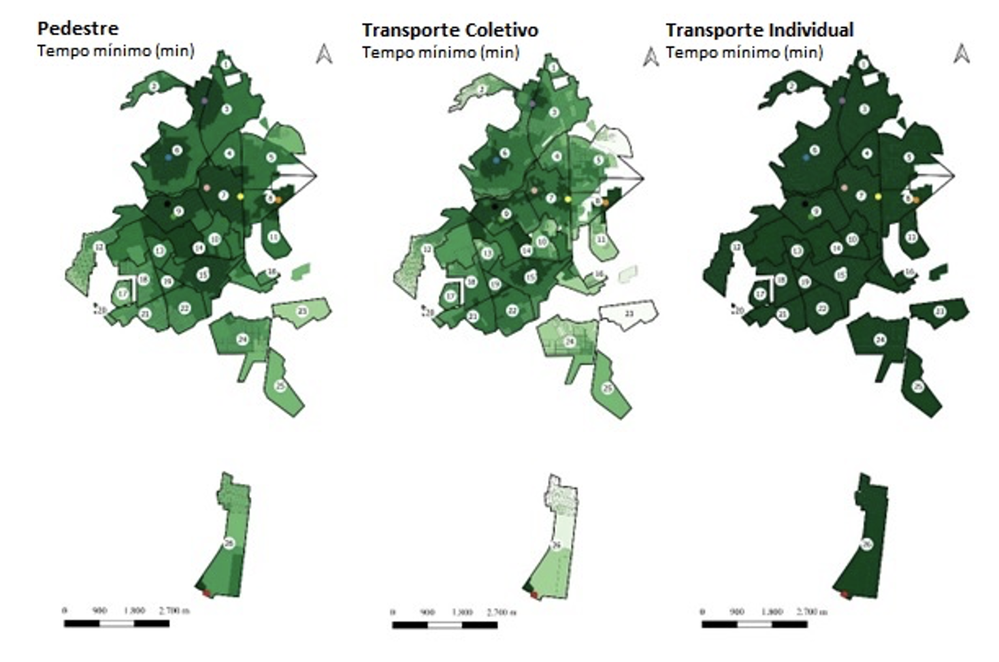
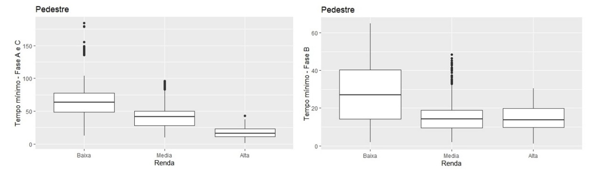
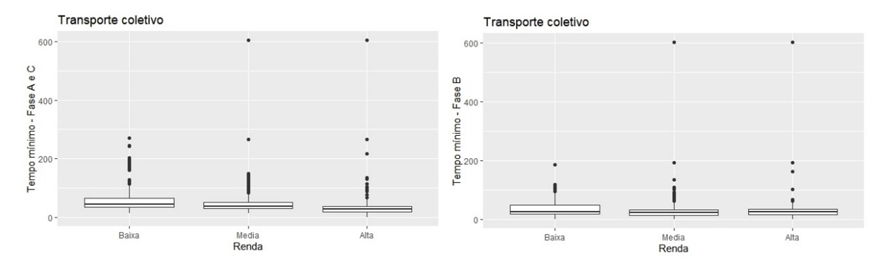
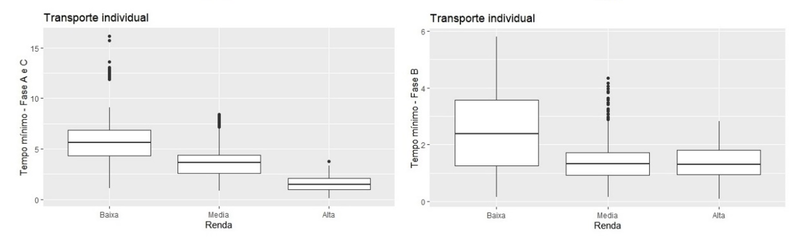

```{r child = "setup.Rmd"}
```

```{r message=FALSE, warning=FALSE, include=FALSE}
library(tidyverse)
library(fontawesome) # from github: https://github.com/rstudio/fontawesome

```

name: xaringan-title
class: left, middle
background-image: url(img/logo-title.png)
background-size: cover

.huge[
.center[

O ACESSO À PARTICIPAÇÃO POPULAR NO PLANEJAMENTO URBANO
]]

.large[
Milena Luiza Ribeiro   
Lílian dos Santos Fontes Pereira Bracarense   
Pedro Igor Galvão Gomes   
Renata Lúcia Magalhães de Oliveira
]

---

# Agenda

.large[
1. Motivação e objetivos
2. Fundamentação teórica
3. Percurso metodológico
4. Resultados e discussão
5. Considerações finais
]

---

# Motivação
.large[
Compreender as **desigualdades socioespaciais em relação ao acesso** aos tradicionais **instrumentos participativos**, predominantemente em formatos presenciais, e as **limitações** que as condições de **acesso** podem impor aos cidadãos.
]

---

# Objetivos

.large[
Identificar as **diferenças** de **acesso** experimentadas por **habitantes** da cidade de Paraíso do Tocantins aos locais onde foram realizadas as **audiências públicas** do **Plano Diretor Participativo da cidade**, em **2018**.

Implicações dos **diferentes níveis de acesso ao processo da participação popular**, entendendo os **formatos existentes** para os processos participativos e **alternativas** mais inclusivas.
]

---

# Fundamentação teórica
### Participação popular
.question[
Processo de tomada de decisão aberto à cidadania, envolvendo temas que, direta ou indiretamente, afetam a vida de grupos e indivíduos no uso e apropriação de um determinado território urbano
]

.bigger[
.center[
Conselhos de políticas públicas   
Conferências nacionais   
Audiências públicas   
Consultas públicas   
]]

???

i) Conselhos de políticas públicas - espaços participativos, que podem ser tanto consultivos como deliberativos, responsáveis por incidir nas políticas públicas de determinado tema (PIRES; VAZ, 2012);
ii) Conferências nacionais - eventos que ocorrem com periodicidade específica nos quais as principais questões e direcionamentos normativos de áreas temáticas em políticas públicas são determinadas (TEXEIRA; SOUZA; LIMA, 2012);
iii) Audiências públicas - encontros públicos presenciais, promovidos pelo governo em torno de temáticas específicas, com o objetivo de discutir aspectos concernentes a uma determinada política, sendo aberta a participação dos indivíduos e grupos interessados (PIRES; VAZ, 2012,);
iv) Consultas públicas - são instrumentos bastante semelhantes às audiências públicas, a principal diferença da consulta pública é que sua estruturação não se dá presencialmente, mas através de ferramentas de votação e colaboração a distância, como internet e telefone (PIRES; VAZ, 2012, p.13).


---

# Fundamentação teórica
### Acessibilidade urbana

.question[
Facilidade de acesso e o potencial de interação dos indivíduos, sendo estabelecida por meio da distribuição espacial dos potenciais destinos, pela relevância e qualidade das atividades encontradas ali e pela conectividade entre esses locais. 
]

.bigger[
.center[
Mensuração e recursos
]]

---

# Percurso metodológico
### Rede

.bigger[
**Tempos calculados** se aproximam dos tempos reais.   
]

.bigger[
**Pedestres**   
- não foram excluídos links específicos da rede
- atributos não modificáveis, como a topografia, foram considerados como elementos de resultam no aumento de impedância, incrementando o tempo de acesso.
- Os fatores de impedância considerados basearam-se no trabalho de Pritchard et al. (2019)
]


???
atributos de rede para cada modo de transporte, uma vez que não havia dados disponíveis de tempo real de deslocamento e a pandemia impôs restrições que prejudicaram a realização de pesquisas em campo, no período de desenvolvimento do estudo

---

# Percurso metodológico
### Rede

.bigger[
**Tempos calculados** se aproximam dos tempos reais.   
]

.bigger[
**Pedestres**
.pull-left[
Velocidade padrão: 3,5 km/h
]]

.bigger[
Inclinação|	Fator impedância|
-------------|------------------------|
< 2%|	1,0
 Entre 2 e 4%|	0,7294
Entre 4 e 6%|	0,4539
Entre 6 e 15%	|0,2359
>= 15%|	0,01
]

---

# Percurso metodológico

.bigger[
**Transporte coletivo por ônibus**

(i) deslocamento entre o ponto de origem por modo a **pé** até o **ponto de embarque mais próximo**;    
(ii) **tempo de espera** estimado a partir do **quadro horário**;    
(iii) tempo de **deslocamento embarcado**, considerando a **velocidade média da linha circular** que conecta os bairros Vila Regina e Jardim Paulista; e    
(iv) **tempo de deslocamento a pé** até o ponto de destino **após desembarque** 
]
<br><br/>
.footnote[
(Cui et al., 2020; Ermagun and Tilahun, 2020; Hernandez et al., 2020; Zuo et al., 2020)
]

---

# Percurso metodológico

.bigger[
**Transporte coletivo por ônibus**

(v) as características para **composição do tempo de deslocamento do pedestre** foram mantidas (Xavier et al., 2020);    
(vi) para cálculo dos **tempos de espera e deslocamento embarcado**, foram assumidas premissas específicas:    
  - a **velocidade média** foi calculada a partir da **extensão do itinerário** e **tempo de ciclo** de uma linha circular, sendo **24 km/h**.  
  - o **tempo de atraso** nas linhas circulares foi calculado considerando o **número de pontos de embarque e desembarque (PED)** de cada linha e um **tempo de atraso equivalente ao ciclo**.
]


---

# Percurso metodológico

.bigger[
**Transporte individual motorizado**

Para o transporte individual motorizado, considerou-se apenas o tempo de deslocamento na **velocidade-padrão de 40 km/h**.  
]

---

# Percurso metodológico

.bigger[
**Matrizes origem-destino** 
]

.bigger[
(i) os **locais** onde foram realizadas as **audiências de cada fase** da elaboração do **Plano Diretor Participativo Municipal de Paraíso** como **destinos**;    
(ii) os **centroides das unidades de análise como origem** e    
(iii) os **tempos de deslocamento estimados** entre origens e destinos para cada alternativa modal
]
.bigger[
**Renda**
]

.bigger[
Três faixas de renda: baixa (até 1,5 sm), média (1,5 a 4 sm) e alta (maior que 4 sm)
]

---

# Percurso metodológico


.bigger[
**Indicadores de acessibilidade**
]

.bigger[
- Tempo mínimo
] 

.bigger[
**Análise**
]
.bigger[
- Estrutura dos dados - espacial e não espacial
- Relação dos níveis de acessibilidade e da renda domiciliar média mensal - Censo de 2010 (IBGE, 2010)
]


---

# Paraíso do Tocantins

```{r echo=FALSE, message=FALSE, warning=FALSE, out.width="50%"}

```


---

# Paraíso do Tocantins
.large[
- Evolução populacional - crescimento maior na década de 70   
- Em 2020 - **51.891 habitantes**   
- Predominância de uma população em idade ativa jovem -  **20 a 49 anos** atinge quase **50%** do total   
- **Habitantes sem escolarização ou com poucos anos de estudo** - **45%**   
- População com **nível superior completo - 8%**    
]


---

# Paraíso do Tocantins

.bigger[
Plano Diretor Municipal de Paraíso foi elaborado em **2018**. 
]

.bigger[
- 12 Audiências Públicas
- 8 Audiências de Leitura Comunitária;

**Fase A** – Planejamento (1ª Audiência Pública para aprovação dos planos de trabalho e comunicação);   
**Fase B** – Diagnóstico (2ª a 9ª Audiências Públicas para Leitura Comunitária e 10ª Audiência Pública para aprovação do diagnóstico);   
**Fase C** – Instrumentação (11ª Audiência Pública para aprovação das Diretrizes e 12ª Audiência Pública para aprovação da Minuta de Lei). 
]

???
As audiências da fase A e da fase C, assim como a 10ª Audiência foram realizadas no horário de 14:00 às 18:00 no auditório da Prefeitura Municipal. As Audiências de Leitura Comunitária ocorreram com frequência aproximadamente quinzenal, no horário de 18:00 às 21:00 em escolas municipais situadas em diferentes setores da cidade.

---

# Resultados e discussões

```{r echo=FALSE, message=FALSE, warning=FALSE, out.width="250%"}

```

---

# Resultados e discussões

```{r echo=FALSE, message=FALSE, warning=FALSE, out.width="250%"}

```

???

mediana para o transporte a pé, o que se explica pela insuficiência de cobertura do sistema de transporte público na cidade

---

# Resultados e discussões


```{r echo=FALSE, message=FALSE, warning=FALSE, out.width="100%"}

```

???

.pull-right[
```{r echo=FALSE, message=FALSE, warning=FALSE, out.width="50%"}

```
]

???
devido à restrição de horários de operação, os usuários sofreram dificuldades adicionais de acesso. As audiências da fase B se iniciaram às 18h, horário no qual estariam ocorrendo as últimas viagens das linhas do sistema de transporte público

---

# Resultados e discussões


```{r echo=FALSE, message=FALSE, warning=FALSE, out.width="100%"}

```


???

```{r echo=FALSE, message=FALSE, warning=FALSE, out.width="50%"}

```


---

# Resultados e discussões

```{r echo=FALSE, message=FALSE, warning=FALSE, out.width="100%"}

```

---

# Resultados e discussões

```{r echo=FALSE, message=FALSE, warning=FALSE, out.width="100%"}

```
---

# Resultados e discussões

```{r echo=FALSE, message=FALSE, warning=FALSE, out.width="100%"}

```

???

a mediana dos tempos mínimos é maior nas quadras de baixa renda para todos os modos de transporte e em todas as fases. 

Os moradores das quadras com renda média alta são os que experimentam menores tempos de deslocamento aos locais de realização das audiências, especialmente das fases A e C, que são fases deliberativas

A maior facilidade de acesso para indivíduos de renda mais alta corrobora as percepções de Cunha (2010) a respeito da propensão desses indivíduos a ocuparem espaços de decisão.

---

# Considerações finais

.bigger[
Veículos motorizados - transporte individual - maior renda - maior acesso

Restrições de acesso para pedestres e usuários de transporte coletivo.

Mesmo utilizando a estratégia de locar as audiências em diferentes regiões da cidade (Fase B) houve áreas prejudicadas, principalmente aquelas mais periféricas.
]

---

# Considerações finais

.bigger[
Horário das audiências

Limitação temporal também aparece para usuários de transporte público

Além do acesso aos locais físicos é necessário prover outros elementos essenciais para oportunizar a efetiva participação. 
]

---

# Considerações finais

.bigger[
Como potencializar o acesso aos instrumentos tradicionais de participação popular?

Como criar alternativas aos instrumentos tradicionais para a participação popular?
]


---
class: middle


.pull-right[
.larger[
.center[
Obrigada!
]]
]

<hr />

&nbsp;


<!-- Add icon library -->
<link rel="stylesheet" href="https://cdnjs.cloudflare.com/ajax/libs/font-awesome/4.7.0/css/font-awesome.min.css">

<link rel="stylesheet" href="https://cdn.jsdelivr.net/gh/jpswalsh/academicons@1/css/academicons.min.css">


<!-- Add font awesome icons -->
<p style="text-align: center;">
    <a href="https://twitter.com/retaoliveira?lang=en" class="fa fa-twitter fa-2x"></a>&nbsp;&nbsp;
    <a href="https://github.com/retaoliveira" class="fa fa-github fa-2x"></a>&nbsp;&nbsp;
    <a href="https://scholar.google.com/citations?user=V6EX45EAAAAJ" class="ai ai-google-scholar ai-2x"></a>&nbsp;&nbsp;
    <a href="https://orcid.org/0000-0002-9011-2342" class="ai ai-orcid ai-2x"></a>&nbsp;&nbsp;
    <a href="http://lattes.cnpq.br/2642488704355833" class="ai ai-lattes ai-2x"></a>&nbsp;&nbsp;
    <a href="https://github.com/retaoliveira/relements/raw/main/texto/index.pdf" class="ai ai-cv ai-2x"></a>

</p>

&nbsp;


